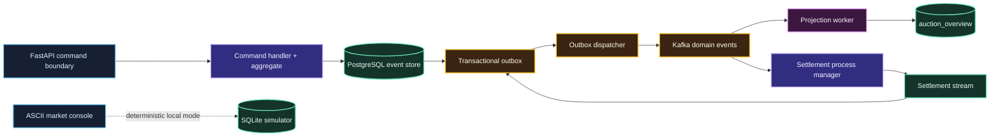

# Thyphon

Thyphon is an event-sourced commodity auction simulator. Autonomous companies
compete for finite mineral lots while the system handles optimistic conflicts,
idempotent commands, asynchronous projections and at-least-once delivery.

The terminal UI runs a deterministic market tape with competing bidders, moving prices and
operational counters. The backend keeps the same concerns explicit in PostgreSQL and Kafka.

## Runtime path



One accepted decision produces immutable facts first. Kafka carries those facts
after commit, projections and Settlement react asynchronously. The console is
deliberately separate from the distributed runtime so a seed can be replayed
without Docker.

## What is implemented

- Event-sourced `Auction` and `Settlement` vertical slices. Streams are
  replayed in full; snapshots are intentionally not used.
- An experimental `Company` aggregate kept outside the live bidding path until
  capital reservation and ownership are modelled end to end.
- Intent-led commands and business-fact events, with one directory per command
  or event.
- PostgreSQL event store, optimistic stream versions, command idempotency and
  transactional outbox.
- Kafka delivery, canonical-event verification, idempotent projections,
  bounded DLQ publication and durable redrive attempts.
- A curses based ASCII market console and a deterministic local simulator.
- Bazel for hermetic tests
- Compose integration checks in CI

## Terminal simulator

```bash
bazel run //apps:tui -- --ticks 12 --seed 18374
bazel test //...
```

The console uses the alternate screen buffer. `Q` exits, `Space` pauses,
`+`/`-` change speed, `R` replays the active seed and `N` enters a new one.

The supported development baseline is Python 3.13 and Bazelisk. The simulator
is hermetic: it needs neither Docker nor a running broker. If Bazel cannot use
its output directory, make that directory writable or set a writable
`--output_user_root`; do not run it with elevated privileges.

## Local runtime

The Compose stack expects a local `.env` file. It is deliberately not included
in the repository. Create it with an API-key map and a non-production webhook
secret before starting services:

```text
THYPHON_API_KEYS={"<api-key>":{"actor_id":"<actor>","role":"supplier","tenant_id":"<tenant>"}}
THYPHON_PROVIDER_WEBHOOK_SECRET=<local-test-secret>
```

Add the roles required by the command paths you intend to exercise:
`supplier`, `bidder`, `operator` and `payment-provider`.

```bash
docker compose up -d --wait
```

The API listens on `http://127.0.0.1:18000`. Commands return an accepted stream
version; queries can request `minimum_version` and receive `202` with
`Retry-After` while the projection catches up.

Stop the local stack without deleting its PostgreSQL volume with:

```bash
docker compose down
```

Use `docker compose down -v` only when deliberately discarding local event
history.

## Operations

```bash
./scripts/launch_thyphon.zsh
```

The launcher checks Docker Desktop, starts missing Thyphon services and opens
the ASCII console in a separate terminal. It keeps the Compose volume between
starts.

Useful entry points:

- [event catalog](docs/event-catalog.md)
- [architecture decision](docs/adr/0001-intention-led-event-sourcing.md)
- [technical architecture](docs/technical-architecture.md)
- [security policy](SECURITY.md)
- [contributing guide](CONTRIBUTING.md)
